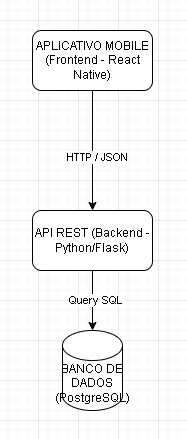

# Documentação da Arquitetura do Sistema

## 1. Descrição da Arquitetura
A arquitetura proposta é **Tier-3 (Três Camadas)**, que garante o desacoplamento e a escalabilidade.

## 2. Componentes do Sistema
1.  **Frontend:** React Native (Expo) - Camada de Apresentação.
2.  **Backend:** Python (Flask) - Camada de Aplicação e Lógica de Negócios.
3.  **Banco de Dados:** PostgreSQL - Camada de Dados.

## 3. Diagrama de Arquitetura
